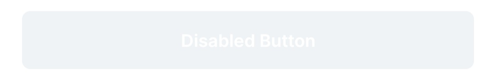
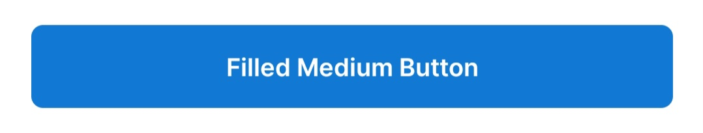
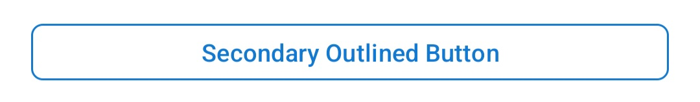
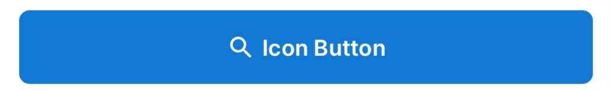

# Buttons

This document outlines the button styles available in the UI Kit. Each button style is designed to be customizable and easy to implement in your Android projects.

## Button Styles Overview

| Button Style                  | Description                                                                                             | Implementation Details                        | Preview                                                           | Disabled Preview                                                   |
|-------------------------------|---------------------------------------------------------------------------------------------------------|-----------------------------------------------|-------------------------------------------------------------------|--------------------------------------------------------------------|
| **Filled Button**             | A solid color button with text and icon color matching the theme. Ideal for primary actions.            | `Widget.EDTS.UIKit.Button.Filled`             |                        |              |
| **Filled Button Medium**      | A medium-sized filled button, suitable for secondary actions.                                           | `Widget.EDTS.UIKit.Button.Filled.Medium`      |          |       |
| **Filled Button Variant**     | A variant of the filled button with an alternative background color.                                    | `Widget.EDTS.UIKit.Button.Filled.Variant`     |               |      |
| **Outlined Button**           | A button with a transparent background and an outlined border. Ideal for secondary or tertiary actions. | `Widget.EDTS.UIKit.Button.Outlined`           |            |            |
| **Outlined Button Medium**    | A medium-sized outlined button with increased padding.                                                  | `Widget.EDTS.UIKit.Button.Outlined.Medium`    |     |     |
| **Outlined Button Secondary** | A secondary variant of the outlined button with a different stroke color.                               | `Widget.EDTS.UIKit.Button.Outlined.Secondary` |  |  |
| **Text Button**               | A text-only button with no background, suitable for less prominent actions.                             | `Widget.EDTS.UIKit.Button.TextButton`         |                      |                |
| **Text Button Medium**        | A medium-sized text button with added padding.                                                          | `Widget.EDTS.UIKit.Button.TextButton.Medium`  |        |         |
| **Icon Button**               | A button designed primarily for icons with no text.                                                     | `Widget.EDTS.UIKit.Button.IconButton`         |                      |                |

**Implementation**:
```xml
<id.co.edtslib.uikit.button.Button
    android:id="@+id/btnFilled"
    android:layout_width="match_parent"
    android:layout_height="wrap_content"
    android:layout_marginTop="@dimen/s"
    android:layout_marginHorizontal="@dimen/s"
    android:text="Filled Button"
    app:buttonType="filled"/>
```
Or
```xml
<Button
    android:id="@+id/btnFilled"
    style="@style/Widget.EDTS.UIKit.Button.Filled"
    android:layout_width="match_parent"
    android:layout_height="wrap_content"
    android:layout_marginTop="@dimen/s"
    android:layout_marginHorizontal="@dimen/s"
    android:text="Filled Button"/>
```

### Note on Setting Styles via XML vs. Runtime

1. **Inflation Efficiency**: When styles are applied through XML, they are processed during the inflation stage, leading to a more efficient layout setup. The attributes are parsed and set before the view is fully initialized, ensuring the layout is optimized from the start.
2. **Runtime Overhead**: Applying styles at runtime requires the view to be updated after its initial creation. This means additional processing is needed to override attributes, potentially leading to performance impacts and additional redraws.

**Recommendation**: Prefer defining view styles via XML where possible to ensure better performance and a smoother user experience.

# Custom Button with Pulsing Shimmer Effect and Touch Animation

This repository provides an implementation of a custom `Button` class for Android that extends `MaterialButton` and includes features such as an optional pulsing shimmer effect and touch animation feedback.

## Features

-   **Shimmer Effect**: Adds a pulsing shimmer effect when `shouldShowShimmer` is set to `true`, making the button visually engaging.
-   **Touch Animation**: Includes scaling animation to provide tactile feedback when the button is pressed and released.
-   **Configurable**: The shimmer effect can be easily enabled or disabled with the `shouldShowShimmer` property.
-   **Styling**: You could change the style of the button based on [Button Styles](#button-styles-overview) with xml style attribute.

## Button Overview

| Button Style                | Description                                                                                               |
|-----------------------------|-----------------------------------------------------------------------------------------------------------|
| **(Default) Filled Button** |   |
| **Variant Button**          |  |

1.  The touch animation is already integrated and works out-of-the-box, providing scale feedback when the button is pressed and released.

## Properties:

-   **`shouldShowShimmer`**: A `Boolean` property to enable or disable the shimmer effect.
-   **`shimmerFrameLayout`**: An optional `ShimmerFrameLayout` instance that manages the shimmer effect when `shouldShowShimmer` is `true`.
-   **`buttonType`**: An Enum Options that manages the Button Styles.
-   **`pressedScale`**: A `Float` that determines hover effect down scale.

## Usage
1.  **Include the `Button` class in your project.**
2.  Set `shouldShowShimmer` to `true` to activate the shimmer effect.
3. Use `pressedScale` from `0` to `1.0` to adjust hover effect.

```xml
<id.co.edtslib.uikit.button.Button
    app:shouldShowShimmer="true"
    app:pressedScale="0.9"
/>
```
Or
```kotlin
edtsButton.shouldShowShimmer = true
edtsButton.pressedScale = 0.9f
```

## Dependencies

Ensure that your project includes the necessary dependencies for `MaterialButton` and `ShimmerFrameLayout`.

```gradle
implementation 'com.google.android.material:material:1.8.0'
implementation 'com.facebook.shimmer:shimmer:0.5.0'
```
