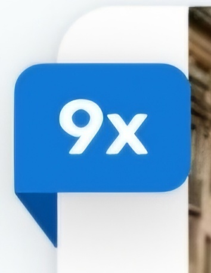
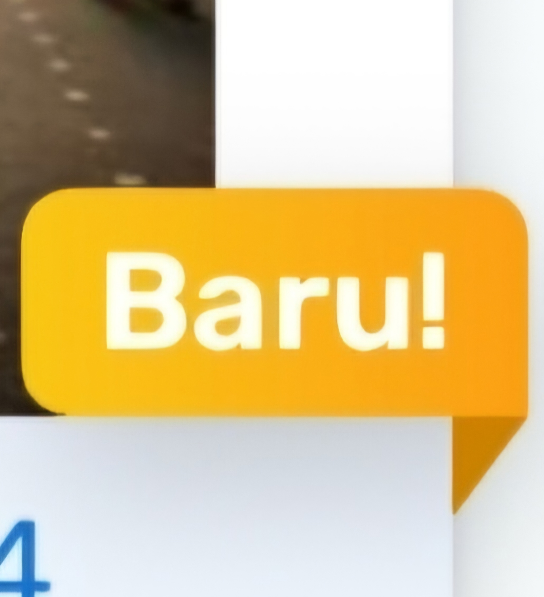

# Ribbon
The `Ribbon` component is a customizable view that displays a triangular ribbon-like element with a text label. It's designed to be used in a variety of Android applications, especially for visual accents like banners or labels. The component supports different styles, colors, and gravity (alignment) settings, allowing for flexible usage in different UI layouts.

## Features
- Customizable text, colors, and gradients
-  Supports two types of horizontal gravity: `START` and `END` for horizontal positioning
-  Supports three types of Vertical gravity: `TOP`, `CENTER` and `BOTTOM` for vertical positioning
-  Option to adjust the text appearance with a custom style
-  Provides an option to attach/anchor to a specific view in the layout

## Ribbon Types Overview
| Ribbon Gravity    | Preview                                  |
|-------------------|------------------------------------------|
| **Start Gravity** |  |
| **End Gravity**   |      |

## Installation
To use the `Ribbon` component, include it in your layout XML or programmatically in your activities or fragments.

### XML Usage
```xml
<!--Normal Container Color-->
<id.co.edtslib.uikit.poinku.ribbon.Ribbon
    android:id="@+id/ribbon"
    android:layout_width="wrap_content"
    android:layout_height="wrap_content"
    app:triangleColor="@color/primary_50" 
    app:containerColor="@color/primary_30"
    app:gravity="start"
    app:textColor="@color/white"
    app:ribbonText="Your Text Here"
    app:textAppearance="@style/TextAppearance_Rubik_Semibold_H3" />

<!--Gradient Container Color-->
<id.co.edtslib.uikit.poinku.ribbon.Ribbon
    android:id="@+id/ribbon"
    android:layout_width="wrap_content"
    android:layout_height="wrap_content"
    app:triangleColor="@color/primary_50" 
    app:containerStartColor="@color/startColor"
    app:containerEndColor="@color/endColor"
    app:gravity="start"
    app:textColor="@color/white"
    app:ribbonText="Your Text Here"
    app:textAppearance="@style/TextAppearance_Rubik_Semibold_H3" />
```

### Programmatic Usage

```kotlin
// To use and acnhor inflated ribbon
binding.ribbon.apply {

}.anchorToView(...)

val ribbon = Ribbon(context).apply {
    triangleColor = Color.RED
    containerColor = Color.BLUE
    containerStartColor = Color.YELLOW
    containerEndColor = Color.GREEN
    ribbonText = "Ribbon Text"
    gravity = Ribbon.Gravity.START
}.anchorToView(
    rootParent = itemBinding.root,
    targetView = itemBinding.tvExpiredIn,
    verticalAlignment = Ribbon.VerticalAlignment.Top
)
```

## Attributes

| Attribute               | Description                                             | Default Value                             |
|-------------------------|---------------------------------------------------------|-------------------------------------------|
| `triangleColor`         | Color of the triangle at the start or end of the ribbon | `@color/primary_50`                       |
| `containerColor`        | Color of the ribbon's container background              | `@color/primary_30`                       |
| `containerStartColor`   | Starting color for gradient background of the container | `Transparent`                             |
| `containerEndColor`     | Ending color for gradient background of the container   | `Transparent`                             |
| `textColor`             | Color of the ribbon's text                              | `@color/white`                            |
| `gravity`               | Gravity to position the ribbon: `START` or `END`        | `START`                                   |
| `ribbonText`            | Text displayed inside the ribbon                        | Empty string                              |
| `cornerRadius`          | Radius for rounded corners of the container             | `@dimen/xxx`                              |
| `textAppearanceRes`     | Text style resource for the ribbon's text               | `@style/TextAppearance_Rubik_Semibold_H3` |
| `textVerticalPadding`   | Padding above and below the text                        | `@dimen/dimen_0`                          |
| `textHorizontalPadding` | Padding to the left and right of the text               | `@dimen/xxx`                              |

## Methods
`anchorToView(rootParent: ViewGroup, targetView: View, verticalAlignment: VerticalAlignment, offsetX: Int, offsetY: Int)`

Anchors the `Ribbon` to a specific `targetView` and positions it relative to that view.

#### Parameters:

-   `rootParent`: The parent `ViewGroup` to attach the ribbon to.
-   `targetView`: The view the ribbon will be anchored to.
-   `verticalAlignment`: Determines the vertical alignment (Top, Center, Bottom).
-   `offsetX`: Horizontal offset for positioning.
-   `offsetY`: Vertical offset for positioning.

## Customization

You can customize various properties of the `Ribbon` component to match your design needs, including the text, colors, corner radius, padding, and more. You can also apply a custom text style using the `textAppearanceRes` attribute.

To further customize the behavior of the `Ribbon`, you can modify the `gravity`, container colors, or triangle positioning. For example, use `gravity` to align the ribbon to the left (`START`) or right (`END`) of the target view.

## Example Use Case

In a scenario where you want to highlight a new coupon in your app, you can use the `Ribbon` component to draw attention to a specific area of the screen, such as a cardView or button. Simply position it using the `anchorToView` method and customize its appearance using the various attributes.


```kotlin
val ribbon = Ribbon(context).apply {
    ribbonText = "99x"
    gravity = Ribbon.Gravity.END
    containerColor = Color.GRAY
    triangleColor = Color.YELLOW
    textColor = Color.BLACK
}

ribbon.anchorToView(rootView, cardView, Ribbon.VerticalAlignment.Top, 6.dp, 10.dp)
```

## Performance Considerations

The `Ribbon` component uses custom drawing with `Path` and `Paint` objects to render its shape and text. If you're using it in a complex layout or RecyclerView, ensure that the component is efficiently managed to avoid unnecessary re-rendering, especially if it's dynamically added and removed from the view hierarchy.

* * *

For further customization or to extend this component, you can ask UX Engineer or Inherit the `Ribbon` and override its methods or add additional functionality as required.
