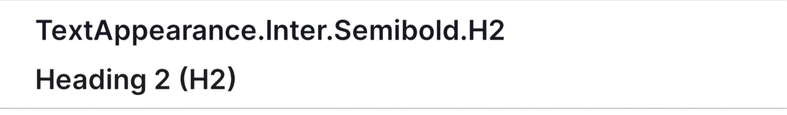

# Typography

## Overview

The EDTS UI Kit provides a variety of typography styles that can be applied to `TextView` elements using the `textAppearance` attribute. Below is a breakdown of the different styles available, categorized by their intended use (Display, Heading, Body, Paragraph, and Other).

Each style is built using the `Inter` font, with variations in font weight, size, and line height to suit different UI components.

## Typography Styles

### Display Styles

| **Style Name**                     | **Example**                            | **Usage**                                                                                                 |
|------------------------------------|----------------------------------------|-----------------------------------------------------------------------------------------------------------|
| `TextAppearance.Inter.Semibold.D1` |  | For large display text. Applied with `android:textAppearance="@style/TextAppearance.Inter.Semibold.D1"`   |
| `TextAppearance.Inter.Semibold.D2` |  | For smaller display text. Applied with `android:textAppearance="@style/TextAppearance.Inter.Semibold.D2"` |

### Heading Styles

| **Style Name**                     | **Example**                                     | **Usage**                                                                                                                   |
|------------------------------------|-------------------------------------------------|-----------------------------------------------------------------------------------------------------------------------------|
| `TextAppearance.Inter.Bold.H1`     |      | For large headings. Applied with `android:textAppearance="@style/TextAppearance.Inter.Bold.H1"`                             |
| `TextAppearance.Inter.Semibold.H1` |  | For large headings with a semibold weight. Applied with `android:textAppearance="@style/TextAppearance.Inter.Semibold.H1"`  |
| `TextAppearance.Inter.Semibold.H2` |  | For medium headings. Applied with `android:textAppearance="@style/TextAppearance.Inter.Semibold.H2"`                        |
| `TextAppearance.Inter.Semibold.H3` |  | For small headings. Applied with `android:textAppearance="@style/TextAppearance.Inter.Semibold.H3"`                         |
| `TextAppearance.Inter.Semibold.H4` |  | For very small headings or section headers. Applied with `android:textAppearance="@style/TextAppearance.Inter.Semibold.H4"` |

### Body Styles

| **Style Name**                    | **Example**                            | **Usage**                                                                                                               |
|-----------------------------------|----------------------------------------|-------------------------------------------------------------------------------------------------------------------------|
| `TextAppearance.Inter.Regular.B1` |  | For body text with larger font size. Applied with `android:textAppearance="@style/TextAppearance.Inter.Regular.B1"`     |
| `TextAppearance.Inter.Regular.B2` |  | For standard body text. Applied with `android:textAppearance="@style/TextAppearance.Inter.Regular.B2"`                  |
| `TextAppearance.Inter.Regular.B3` |  | For body text with smaller font size. Applied with `android:textAppearance="@style/TextAppearance.Inter.Regular.B3"`    |
| `TextAppearance.Inter.Regular.B4` |  | For small text or secondary information. Applied with `android:textAppearance="@style/TextAppearance.Inter.Regular.B4"` |

### Paragraph Styles

| **Style Name**                    | **Example**                            | **Usage**                                                                                          |
|-----------------------------------|----------------------------------------|----------------------------------------------------------------------------------------------------|
| `TextAppearance.Inter.Regular.P1` |  | For paragraph text. Applied with `android:textAppearance="@style/TextAppearance.Inter.Regular.P1"` |

### Other Styles

| **Style Name**                             | **Example**                                              | **Usage**                                                                                                                  |
|--------------------------------------------|----------------------------------------------------------|----------------------------------------------------------------------------------------------------------------------------|
| `TextAppearance.Inter.Regular.Error`       |              | For error messages. Applied with `android:textAppearance="@style/TextAppearance.Inter.Regular.Error"`                      |
| `TextAppearance.Inter.Regular.Error.Black` |  | For error messages in black color. Applied with `android:textAppearance="@style/TextAppearance.Inter.Regular.Error.Black"` |

## How to Apply Typography Styles

To apply a specific typography style to a `TextView`, use the `textAppearance` attribute in your XML layout file:

```xml
<MaterialTextView
    android:layout_width="wrap_content"
    android:layout_height="wrap_content"
    android:text="Sample Text"
    android:textAppearance="@style/TextAppearance.Inter.Semibold.D1"/>
