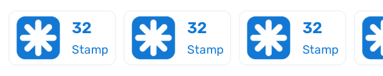
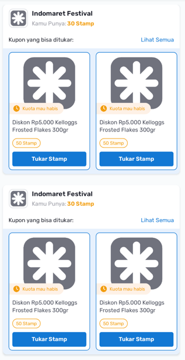

Stamp Exchange Guidelines UI
============================

This document describes the UI layout and components used in `GuidelinesBucketStampActivity`. The layout is structured using `ConstraintLayout` with an `AppBarLayout`, a `BucketChipGroup`, and a `RecyclerView`.
- [Layout File](https://github.com/shidiq-uxe/poinku_ui_kit/blob/main/app/src/main/res/layout/activity_guidelines_bucket_stamp_activitty.xml)
* * * * *

UI Overview
--------------

The UI consists of:

1.  **Coachmark**: An Overlay for page hint, explained in [CoachmarkView](https://github.com/shidiq-uxe/poinku_ui_kit/blob/main/docs/Coachmark.md)

2.  **AppBarLayout**:

    -   Displays a title using `MaterialTextView`.
    -   Contains a `BucketChipGroup` for chip selection [BucketChipGroup](https://github.com/shidiq-uxe/poinku_ui_kit/blob/main/docs/BucketChipGroup.md).

3.  **RecyclerView**:

    -   Displays a list of stamp buckets.

* * * * *

XML Layout Breakdown
------------------------

### ConstraintLayout (Root View)

```xml
<androidx.constraintlayout.widget.ConstraintLayout
    android:layout_width="match_parent"
    android:layout_height="match_parent"
    android:background="@color/grey_10">
```

-   Acts as the root layout.

-   Provides structured constraints for child components.

### AppBarLayout (Header)

```xml
<com.google.android.material.appbar.AppBarLayout
    android:id="@+id/appBar"
    android:layout_width="match_parent"
    android:layout_height="wrap_content"
    android:paddingBottom="@dimen/xs">
```

-   Hosts the title and `BucketChipGroup`.

-   Elevation provides a shadow effect.

#### Title

```xml
<com.google.android.material.textview.MaterialTextView
    android:id="@+id/tvStampChipGroupBucket"
    android:text="@string/stamp_chip_group_title"
    android:textAppearance="@style/TextAppearance.Rubik.B2.Light"/>
```

-   Displays the stamp chip group title.

#### Chip Group

```xml
<id.co.edtslib.uikit.poinku.chip.BucketChipGroup
    android:id="@+id/cgBucket"
    android:layout_width="wrap_content"
    android:layout_height="wrap_content"
    tools:listitem="@layout/chip_stamp_bucket"/>
```

-   Used for selecting stamp bucket categories.

- 

### RecyclerView (Bucket List Content)

```xml
<androidx.recyclerview.widget.RecyclerView
    android:id="@+id/rvBucket"
    android:layout_width="@dimen/dimen_0"
    android:layout_height="@dimen/dimen_0"
    tools:listitem="@layout/item_stamp_bucket"/>
```

-   Displays stamp bucket items.

-   Uses `LinearLayoutManager` for vertical scrolling.

- 


RecyclerView Item Preview
-----------------------------

The layout used for individual RecyclerView items is defined in `item_stamp_bucket.xml`. Below is a placeholder preview:
- [View item_stamp_bucket.xml](https://github.com/shidiq-uxe/poinku_ui_kit/blob/main/app/src/main/res/layout/item_bucket_stamp.xml)
- [View item_grid_poinku_stamp.xml](https://github.com/shidiq-uxe/poinku_ui_kit/blob/main/uikit/src/main/res/layout/item_grid_poinku_stamp)